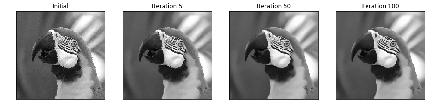

# Image Restoration using Plug-and-Play CNN MAP Denoisers

This is an implementation of the Image Restoration using Plug-and-Play CNN MAP Denoiser.

## Prerequisities

* Tensorflow 1.14
* Pillow
* matplotlib (for plotting)
* scikit-image (for computing the SSIM)

## Theory
We assume standard degradation model *y = Kx + n*, where n is Gaussian noise with standard deviation *sigma*.
The algorithm optimizes the MAP objective.
That is: find _x_ such that _(1/2\*sigma^2) ||Kx -y|| - log p(x)_ is minimal.
This objective optimized using ADMM algorithm consisting of 3 steps:

1) x := argmin_x 1/2\*sigma^2 ||Kx-y|| + rho/2 ||x-z_hat+lambda||
2) z := argmin_z -log p(z) + rho/2 ||x-z+lambda||
3) lambda := lambda + (x - z)

The first equation is solely dependent on the degradation of matrix K, and it has a closed-form solution for some tasks.
The second equation is a MAP denoising problem. While this can be approximated by MMSE Denoising, we propose to optimize
the MAP objective directly using the following neural network:

Assuming we have an optimal Denoising Auto-Encoder R* (trained to denoise images degraded with Gaussian noise of standard
deviation sigma_R), we introduce network D minimizing the following loss:
L_MAP = Sum_v 1/sigma_R^2 ||D(v) - R*(D(v))|| + rho/2 ||D(v) - v|| 
In the paper, we show that this loss minimizes the MAP denoising objective.

## MAP Denoising

In practice, we train the D and R together, but when training D, the gradients are not propagated through R. For training
the MAP denoiser please see the [MAPdenoiser.py](MAPdenoiser.py). 

### Training MAP denoiser
This repository contains a model for the restoration of grayscale images and a model for the restoration of colour images.
Nevertheless, you are free to retrain the data on your own dataset. 
In that case prepare a dataset in numpy .npy format organized as follows \[sample, height, width, channels\]. 

The example usage is 
```python
from MAPdenoiser import MAPdenoiser
DAE = MAPdenoiser(stddev=11.0/255.0, channels=3)
DAE.train(epoch = 50, batch_size = 128, lr = 0.0001, phase = "train",
          ckpt_dir = './models/map_color', sample_dir ='./sample',
          dataset_path = './data/img_clean_pats_rgb.npy', eval_set ='Set12',
          eval_every_epoch=1)
DAE.freeze_graph(ckpt_dir = './models/map_color')
``` 

## Non-blind Deblurring (real blur)
For non-blind image deblurring, we can use a closed-form solution to solve equation 1 (assuming circular convolution).
The code is located in [fastMAPdeblurer.py](fastMAPdeblurer.py) and the example usage for colour images might be found 
in [MAPDeblurer_color.ipynb](MAPDeblurer_color.ipynb) and for grayscale images in [MAPDeblurer_gray.ipynb](MAPDeblurer_gray.ipynb) 

```python
import numpy as np
from scipy.io import loadmat
from PIL import Image
from fastMAPdeblurer import fastMAPDeblurer
from utils import real_blur_and_noise

kernel = loadmat('./data/kernels/kernels.mat')['kernels'][0,0]
gt = np.array(Image.open('./data/images/kodim23.png').convert('RGB'), dtype='float32')

sigma_d = 255 * .01 # Sigma that was used to degrade the image 
sigma_dae = 7       # Sigma that was used to train MAP denoiser
rho = 1 / (2*sigma_dae**2)

degraded = real_blur_and_noise(gt, kernel, sigma_d)

deblurer = fastMAPDeblurer(rho, sigma_d, gt.shape,
                           kernel_shape=kernel.shape,
                           denoiser = './models/map_color/optimizedMAPdenoiser.pb')

estimate = deblurer.optimize(degraded, kernel, gt, nr_iters=75, test_iter=1, plot=True)
```

Note: Although the closed-form solution assumes circular convolution, we use only the valid part of the image and we approximate the edge regions throughout the computation. Therefore, this approach can be used for **real blur** as well.


## Inpainting (random dropping of pixels)
For image inpainting we cannot find a closed-form solution, therefore we use gradient descent to solve equation 1.
The code is located in [MAPinpainting.py](MAPinpainting.py) and the example usage for colour images might be found 
in [MAPInpainting_color.ipynb](MAPInpainter_gray.ipynb)

```python
import numpy as np
from PIL import Image
from MAPinpainting import MAPinpainting
from utils import drop_and_noise, median_inpainting

sigma_d = 255 * .01
sigma_dae = 7
rho = 1 / (sigma_dae**2)

gt = np.array(Image.open('./data/images/kodim23.png').convert('L'), dtype='float32')
degraded, mask = drop_and_noise(gt, sigma_d, 0.8)
initial = median_inpainting(degraded, mask)

inpainter = MAPinpainting(rho, sigma_d, initial.shape,
                           denoiser = './models/map_gray/optimizedMAPdenoiser.pb')

res = inpainter.optimize(initial, mask, gt, nr_iters=100, test_iter=5, plot=True)
```

The optimization is initialized with median inpainting.


